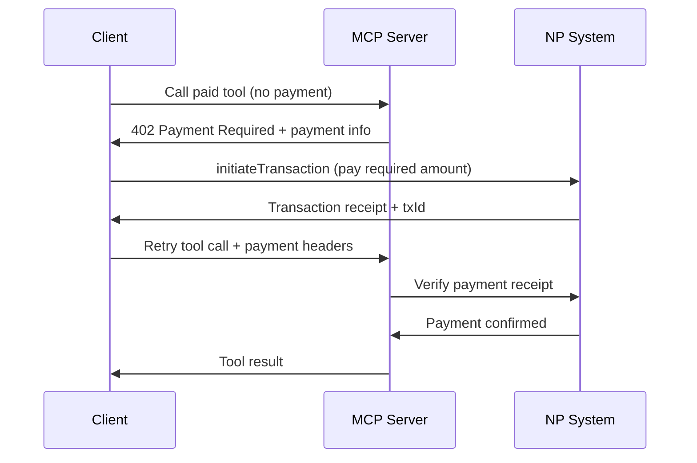

# x402-NP: HTTP Payment Protocol for Nanda Points

This implementation brings x402 payment protocol support to the Nanda Points MCP server, enabling agents to pay for tool access using NP instead of cryptocurrency.

## Overview

The x402 protocol uses HTTP 402 "Payment Required" status codes to gate access to paid resources. Our x402-NP implementation adapts this to work with the existing Nanda Points infrastructure.

## How It Works

### 1. Payment Flow



### 2. Payment Headers

When retrying a paid tool call, include these headers:

- `X-PAYMENT-AGENT`: Your agent name (payer)
- `X-PAYMENT-TX-ID`: Transaction ID from NP transfer
- `X-PAYMENT-AMOUNT`: Amount paid in NP points

### 3. Error Responses

The server returns structured error responses:

**402 Payment Required:**
```json
{
  "jsonrpc": "2.0",
  "error": {
    "code": -32402,
    "message": "Payment Required",
    "data": {
      "protocol": "x402-np",
      "tool": "getBalance",
      "price": {
        "amount": 1,
        "currency": "NP",
        "scale": 2,
        "recipient": "system"
      },
      "description": "Get agent balance in Nanda Points",
      "instructions": {
        "steps": [
          "Use initiateTransaction tool to transfer 1 NP from your agent to system",
          "Include the returned txId in X-PAYMENT-TX-ID header",
          "Include your agent name in X-PAYMENT-AGENT header",
          "Include the amount in X-PAYMENT-AMOUNT header",
          "Retry the tool call with payment headers"
        ]
      }
    }
  },
  "id": 1
}
```

## Configuration

### Paid Tools Configuration

Tools are configured in `src/mcp/server.ts`:

```typescript
const paidToolsConfig: { [toolName: string]: NPToolConfig } = {
  "getBalance": {
    priceNP: 1,
    recipient: "system",
    description: "Get agent balance in Nanda Points"
  },
  "initiateTransaction": {
    priceNP: 2,
    recipient: "system",
    description: "Transfer NP between agents"
  },
  "getReceipt": {
    priceNP: 1,
    recipient: "system",
    description: "Retrieve transaction receipt"
  }
};
```

### Free Tools

These tools remain free to use:
- `getPaymentInfo` - Get payment requirements for all tools
- `setServiceCharge` - Set per-call service charges

## Client Implementation

See `examples/x402-client.ts` for a complete client implementation that handles the payment flow automatically.

## Example Usage

```typescript
import { X402NPClient } from './examples/x402-client';

const client = new X402NPClient('http://localhost:3000', 'alice');

// This will automatically handle payment if required
const balance = await client.callPaidTool('getBalance', {
  agent_name: 'alice'
});
```

## Benefits

1. **No crypto required** - Uses existing NP infrastructure
2. **Instant settlement** - Payments verified immediately via receipts
3. **Agent-native** - Natural fit for agent-to-agent payments
4. **Standard protocol** - Compatible with x402 specification
5. **Backwards compatible** - Existing tools work unchanged

## Security Features

- Payment verification using cryptographic receipts
- Amount matching validation
- Agent existence verification
- Transaction replay protection via unique txIds
- Structured error handling

## Monitoring

Payment activities are logged with:
```
✅ Payment verified: alice paid 1 NP to system for getBalance
```

## Future Enhancements

- Rate limiting per agent
- Payment caching to avoid repeated payments
- Bulk payment support
- Payment analytics and reporting